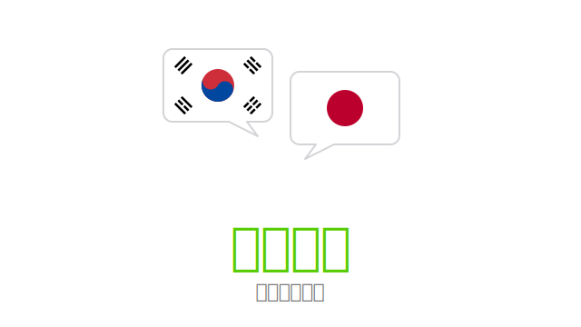

<p align="center">
  
</p>

# 도란도란 (Dorandoran)

> **둘이서 도란도란** — 한·일 커플을 위한 비공개 2인용 언어 교환 일기 PWA.

「여럿이 나직한 목소리로 정답게 이야기하는 모양」이라는 한국어 의태어에서 따온 이름입니다.
일본어로는 ドランドラン.

## 컨셉
- 학습자가 그날 배운 표현을 카드로 기록
- 상대방(원어민)이 댓글·이모지로 반응
- SM-2 알고리즘 기반 플래시카드 복습
- 음성 녹음(MediaRecorder), Web Push 알림, 오프라인(Serwist)

## 모노레포 구조
```
dorandoran/
├── apps/
│   ├── web/          # Next.js 15 PWA (@dorandoran/web)
│   └── api/          # Hono API (@dorandoran/api)
├── packages/
│   ├── db/           # Drizzle 스키마 (@dorandoran/db)
│   └── shared/       # 공통 타입·zod (@dorandoran/shared)
└── infra/            # CDK (추후)
```

## 시작하기

### 사전 준비
- Node 22+
- pnpm 9+ (`npm i -g pnpm` 또는 `corepack enable`)

### 설치
```bash
pnpm install
```

### 개발 서버
```bash
pnpm dev:web   # Next.js 15  http://localhost:3000
pnpm dev:api   # Hono        http://localhost:8787
```

### 환경 변수 (`apps/api/.env`)
```
JWT_SECRET=...
DB_PATH=./data/dorandoran.db
S3_BUCKET=dorandoran-audio
AWS_REGION=ap-northeast-2
VAPID_PUBLIC_KEY=...
VAPID_PRIVATE_KEY=...
VAPID_SUBJECT=mailto:you@example.com
MAIL_FROM=no-reply@dorandoran.app
OWNER_EMAILS=you@example.com,partner@example.com
```

## 기술 스택
- Next.js 15 (App Router) + TypeScript + Tailwind
- Serwist (PWA)
- Hono on Node 22
- SQLite (better-sqlite3) + Drizzle ORM
- TanStack Query + Zustand
- Magic Link 인증 (자체 구현)
- AWS EC2 t4g.micro + S3 + CloudFront (예정)

## 라이센스
[MIT](./LICENSE) © 2026 AengChoon

이 레포는 둘만 쓰는 비공개 2인 PWA의 *코드*가 공개된 형태입니다.
직접 셀프호스팅으로 운영하려면 `apps/api/.env.example`을 복사해 새 시크릿(JWT_SECRET 등)으로 채우고, `OWNER_EMAILS`에 본인·파트너 이메일을 넣어 시작하세요.
